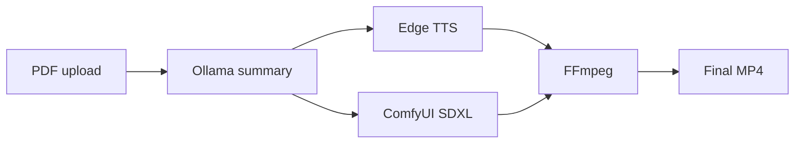

# Brief Bot — System overview

## 1. System architecture

**Purpose.** Brief Bot turns a **news-style PDF** into a **plain-text summary** (via Ollama), then a **single MP4**: one narration track, one generated still/motion visual, optional news bed.

**End-to-end flow.**

1. **Ingest** — The user uploads a PDF via the **FastAPI** dashboard (`app/`). Text is extracted server-side.
2. **Summarize** — **`processor.py`** compacts text (optional cap `BRIEF_BOT_MAX_SOURCE_CHARS`) and sends it to **Ollama** with a **simple system prompt**: produce a **prose summary only**—no JSON, no “key points” headings, no section labels. The reply is stored as `brief.json` → `{ "summary": "..." }`.
3. **Speech + visual** — **`pipeline.py`** runs **Edge TTS** on the full summary and **one** ComfyUI image from a **visual subject** derived from the opening of the summary. **`generator.py`** uses one **HTTP client** for ComfyUI (`/prompt`, `/history`, `/view`). Still images are timed to the narration in **`video_editor`**.
4. **Assemble** — **`assembler`** muxes narration with the clip; a single segment skips multi-clip cross-fades (FFmpeg copy-through). An optional **news bed** can be mixed on the final file.

**Deployment shape.** The app is typically **local** (Python + Ollama on the same machine). **ComfyUI** may run **elsewhere** (e.g. GPU in the cloud) and is reached by **HTTPS URL** (`COMFYUI_URL`). A tunnel (Cloudflare, ngrok, etc.) is common so the local app can call a remote ComfyUI instance without VPN complexity.

**Colab notebook (`docs/Brief_Bot_ComfyUI_on_Google_Colab.ipynb`) and why it matters for ComfyUI**

Brief Bot **does not ship** ComfyUI or GPU binaries. It only speaks to **ComfyUI’s HTTP API** (`/prompt`, `/history`, `/view`). Someone must run ComfyUI with a compatible checkpoint and a **reachable** base URL.

- **Significance:** Diffusion at SDXL resolution is **GPU-heavy**. Many users do not have a suitable local GPU. **Google Colab** provides a CUDA machine on demand; the notebook automates the repeatable setup: install ComfyUI, download the **same Juggernaut XL v8** file this repo defaults to, start `main.py` on `0.0.0.0:8188`, then expose that port with **Cloudflare Tunnel** (`cloudflared`, `*.trycloudflare.com`). That gives a stable **`COMFYUI_URL`** pattern for **Brief Bot on your laptop** → **ComfyUI on Colab** without changing application code.

- **Role in the architecture:** The notebook is **infrastructure-as-recipe**, not part of the Python import graph. It is the **bridge** between “no local GPU” and the **Comfy** box in the diagram below: once `COMFYUI_URL` points at the tunneled Colab instance, `generator.py` treats it like any other ComfyUI host.

- **Operational caveat:** Colab sessions are **ephemeral**. The tunnel URL and runtime go away when the notebook disconnects. For production-style use you would replace Colab with a persistent GPU host; the **same** API contract and `COMFYUI_URL` configuration still apply.

**Data flow (conceptual).**

---

## 2. Tools and models

| Layer | Technology | Role |
|--------|------------|------|
| **Web / API** | FastAPI, Jinja2 templates, static JS | Dashboard, upload, job status, downloads |
| **PDF** | pypdf | Text extraction |
| **LLM** | **Ollama** + **Llama 3.2** (configurable) | Plain-text article summary (no JSON workflow) |
| **Speech** | **edge-tts** (Microsoft Edge neural voices) | Narration MP3s, no cloud API key for TTS |
| **Images** | **ComfyUI** + **Juggernaut XL** (SDXL-class checkpoint) | One visual per segment; HTTP API only |
| **Video assembly** | **FFmpeg** / **ffprobe** | Durations, mux, cross-fade, optional bed |
| **Config** | python-dotenv | `.env` for URLs, model names, voices |

**Notable design choices.** The visual prompt comes from the **opening of the summary**, not PDF figures. **Ollama input** is compacted to cut latency. **Edge TTS** can batch multiple clips when there are several segments; the default path is **one** summary and **one** ComfyUI image. **ComfyUI** uses **history polling** and a **single** `httpx` session per job. See **README** for env tunables (`BRIEF_BOT_MAX_SOURCE_CHARS`, `BRIEF_BOT_EDGE_TTS_CONCURRENCY`, `COMFYUI_POLL_INTERVAL_SEC`).

---

## 3. Cost considerations

**Why this project stays cost-effective.** The architecture deliberately combines **free or local-first** components with **cloud GPU only where diffusion needs it**, so you avoid paying for proprietary “video APIs” and avoid buying a **desktop GPU** just to run SDXL-class generation.

**Open-source and zero-API-cost building blocks.**

- **Ollama** — Runs **locally** for article **summaries**; no per-token cloud bill (you pull an open model and run it on the CPU/GPU you already have).
- **Edge TTS** (`edge-tts`) — **Neural narration** from the Microsoft Edge voices, usable from Python **without** a separate paid TTS API; audio is generated locally during the job.
- **ComfyUI + Juggernaut XL** — **Open** Comfy stack and an **SDXL-class** checkpoint for **still / image** production; you pay **time**, not a per-clip SaaS fee. One diffusion job per brief keeps compute predictable.
- **FFmpeg** — **Free** assembly (mux, optional bed); no transcoding API.

**Google Colab (free-tier T4) instead of a local GPU.** Heavy lifting for **Juggernaut** is offloaded to **Google Colab**, which can provide a **NVIDIA Tesla T4** on the free tier (availability varies by account and quotas). That means you do **not** need a gaming or workstation **GPU on the desktop** to produce the visual: the laptop runs the **dashboard, Ollama, Edge TTS, and FFmpeg**, while **ComfyUI** runs in Colab and is reached over **`COMFYUI_URL`** (e.g. via Cloudflare Tunnel). For students and prototypes, that split is a large **capital savings** versus purchasing hardware.

**VRAM fit (Juggernaut XL on T4).** A typical **SDXL / Juggernaut XL** workflow at this project’s resolutions is often estimated around **roughly 6–8 GB VRAM** for inference—**well below** the **~15 GB** total VRAM commonly associated with a **T4** in Colab. That headroom reduces out-of-memory failures and leaves margin for the rest of the ComfyUI graph (VAE, CLIP, etc.), which supports **reliable, low-friction** runs on free-tier GPUs.

**Direct API spend (typical setup).** The default stack avoids **per-token** and **per-minute** cloud APIs for the core loop. Optional costs: **tunnel** services (many have free tiers), **Colab** if you outgrow free limits, or a **paid** GPU host for production.

**Compute you pay for (indirect).**

- **Local machine** — Electricity and wear for **Ollama**, **Edge TTS**, and **FFmpeg**; no marginal API fee per PDF for those pieces.
- **Remote ComfyUI** — **Free Colab** time when available, or paid GPU hours elsewhere. The default pipeline runs **one** diffusion job per PDF.

**Scaling and operations.**

- **Throughput** — **Ollama** runs once per brief; **ComfyUI** runs once per brief for the default single-summary path.
- **Reliability** — Long ComfyUI runs over tunnels favor **HTTP polling** (as implemented) over WebSockets to reduce failed jobs and **wasted GPU** retries.
- **Storage** — Uploads and outputs under `data/`; disk use grows with retained MP4s and intermediates.

**Summary.** Brief Bot is **cost-effective** because it stacks **open tools** (**Ollama**, **edge-tts**, **ComfyUI**, **Juggernaut XL**, **FFmpeg**), uses **Colab’s T4** for **cheap or free** GPU inference instead of mandating local hardware, and keeps **marginal cost per brief** low compared to all-in-one commercial video APIs—while retaining **control** over prompts, models, and assembly.
